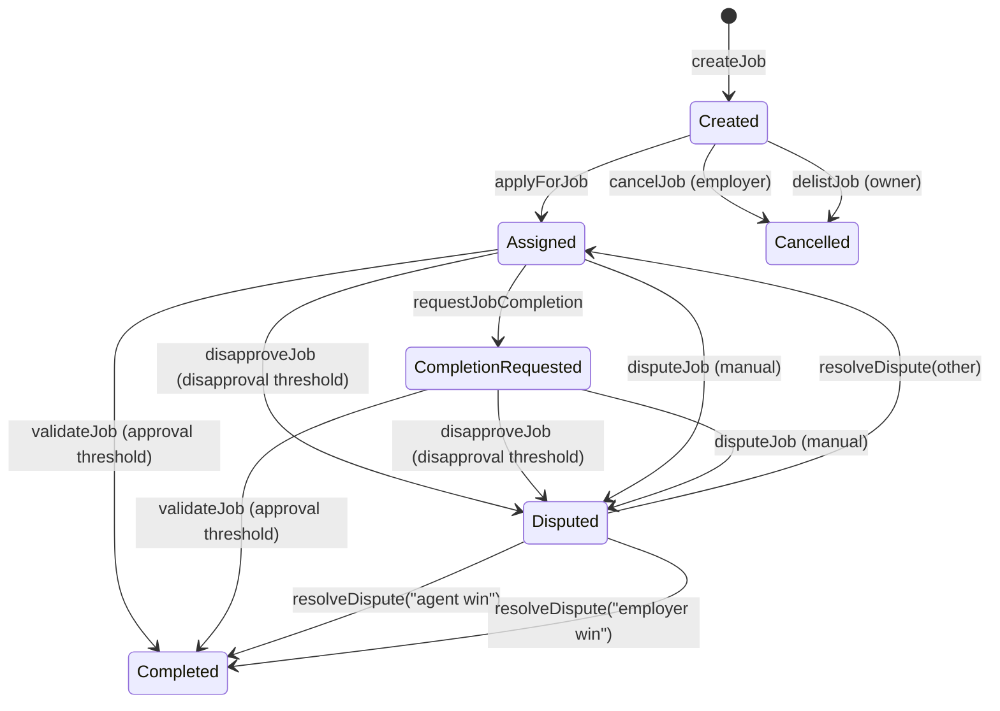

# Happy path walkthrough (end‑to‑end)

This is the simplest, **non‑technical** path for a successful job lifecycle.

> ⚠️ **Subdomain label only**: When entering an identity subdomain, use **only the label** (e.g., `helper`, **not** `helper.agent.agi.eth`). The contract derives the full name from a fixed root node + label.

## Before you start
1. **Choose the correct network** (e.g., Sepolia or Mainnet) and connect your wallet.
2. **Get the official contract address** (from a verified deployment announcement, README, or operator). Do not guess.
3. **Read the AGI token address from the contract** (read‑only call to `agiToken`).
4. **Approve token spend before actions that transfer AGI**:
   - Employer: approve **before** `createJob`.
   - Buyer: approve **before** `purchaseNFT`.
5. If you’re an **Agent** or **Validator**, confirm eligibility (allowlist, Merkle proof, or ENS ownership). See [`merkle-proofs.md`](merkle-proofs.md).

## Recommended UI entry point
Use the Web UI: [`docs/ui/agijobmanager.html`](../ui/agijobmanager.html)
- You can also use Etherscan (write with wallet) or Truffle console for read‑only checks.

## Job lifecycle (state machine)

## Employer happy path
1. **Approve AGI tokens** for the contract.
2. **Create job** with:
   - IPFS hash (job spec)
   - Payout amount
   - Duration
3. Wait for an agent to apply.
4. (Optional) If there’s a disagreement, open a dispute.
5. Receive job NFT on completion.

## Agent happy path
1. **Verify eligibility** (allowlist / Merkle / ENS ownership).
2. **Apply for job** with your subdomain **label only** and proof if required.
3. Complete the work off‑chain and upload final artifacts to IPFS.
4. **Request completion** with the new IPFS hash.
5. If a dispute occurs, provide evidence to the moderator.

## Validator happy path
1. **Verify eligibility** (allowlist / Merkle / ENS ownership).
2. **Review job details** and evaluate the deliverables.
3. **Approve** or **disapprove**:
   - Approvals add toward completion.
   - Disapprovals can trigger a dispute.

## Moderator happy path
1. Review evidence off‑chain.
2. Call `resolveDispute` with **exact** resolution strings:
   - `agent win` or `employer win`.
3. Confirm the job state is updated and payouts/refunds executed.

## Quick reminders
- A **completion request** is not required for validators to approve, but it signals that the agent is done.
- Disputes can be raised by the employer or assigned agent.
- Always use **label only** for subdomain inputs (no full ENS name).
